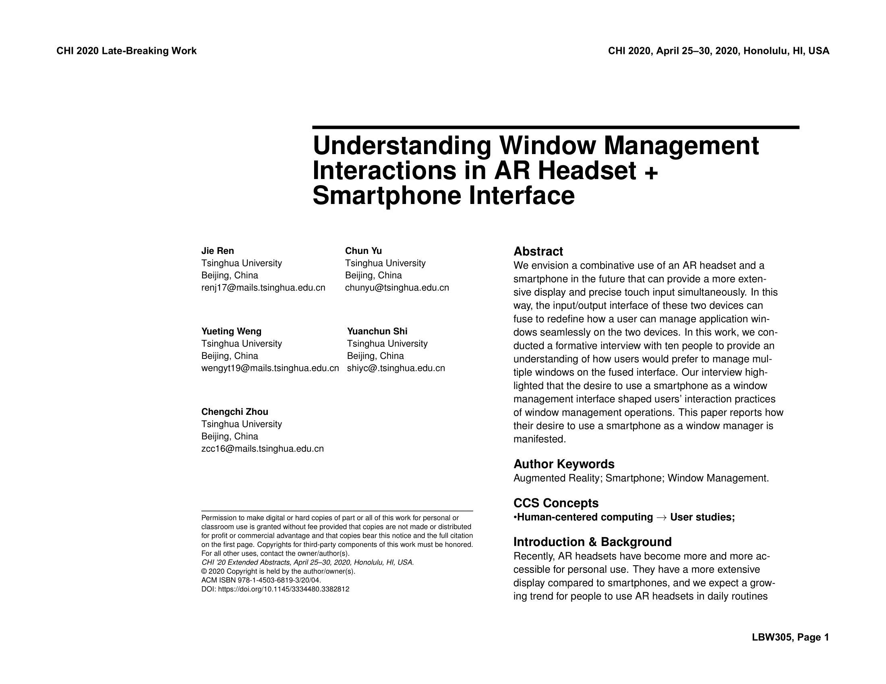
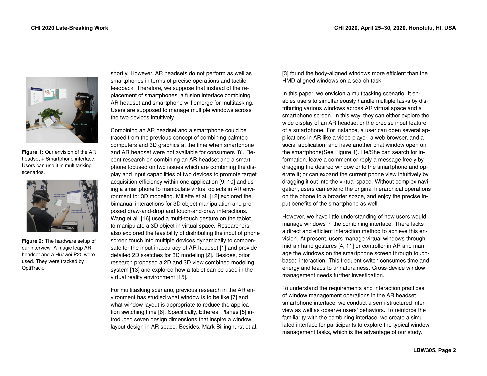
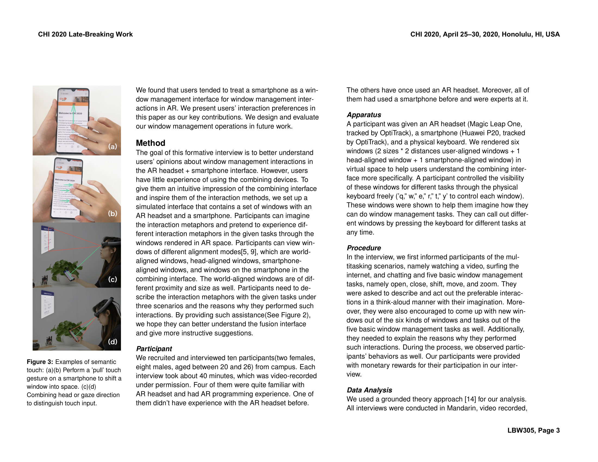
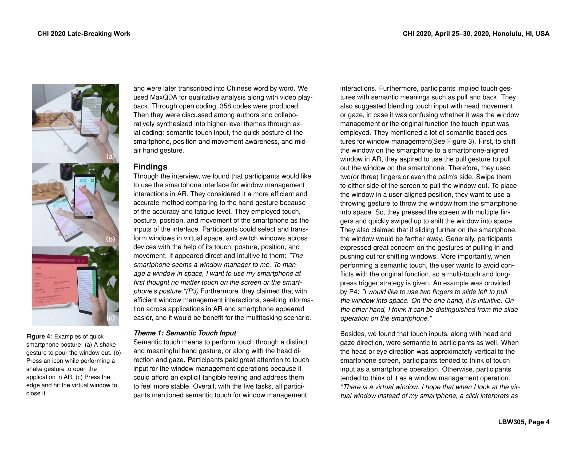
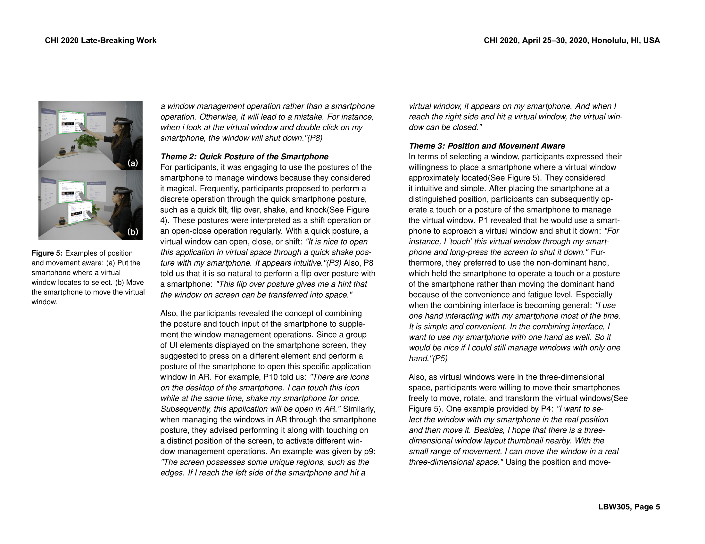
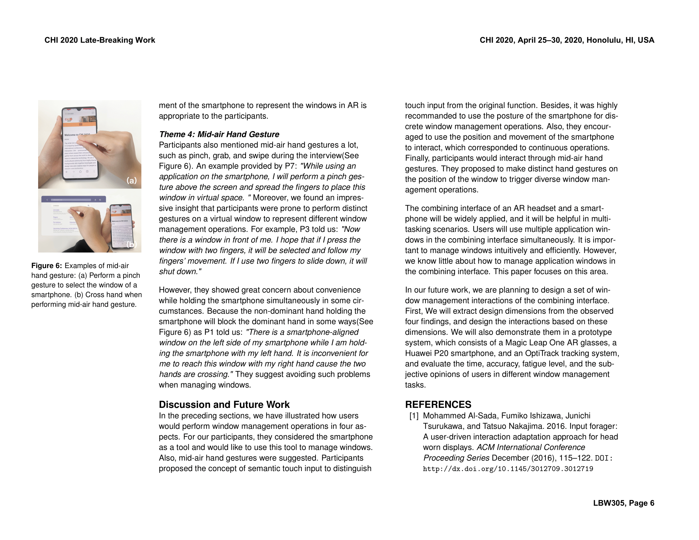
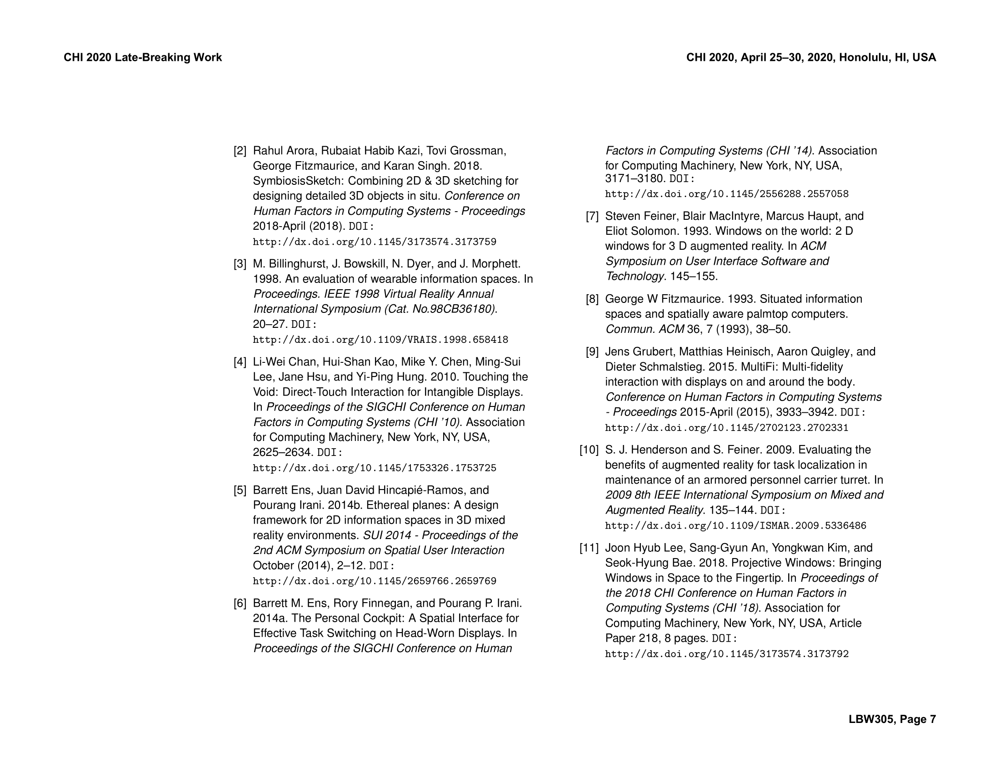
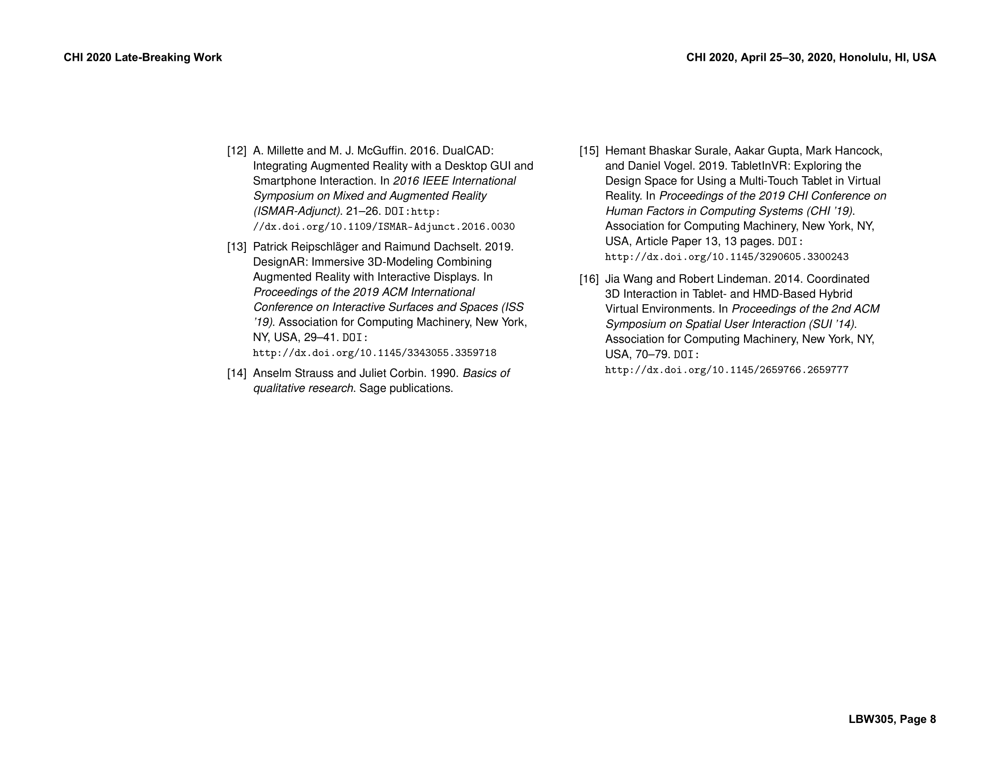

# ARPhone
The android control interface of AR devices (e.g., MagicLeap, Hololens) in the poster: "Understanding Window Management Interactions in AR Headset + Smartphone Interface" and following projects.

